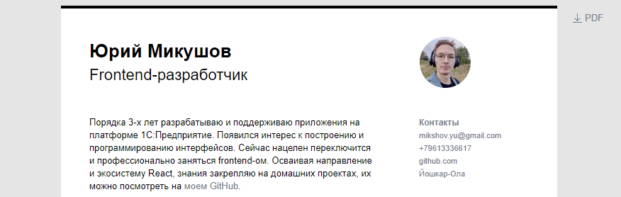

# Curriculum vitae

It's my CV. You can see it [yurimikushov.github.io/cv](https://yurimikushov.github.io/cv).



# Feature

* You can download the CV in PDF file, check the right sidebar
* `Gulp` task runner is used to build the project, check [gulpfile.js](gulpfile.js):
  * A CSS styles are minified and merged into the `bundle.min.css`
  * A JS scripts are converted using babel, minified and merged into the `bundle.min.js`
  * An images are minified

# Usage

Installs the project

```
git clone https://github.com/yurimikushov/yurimikushov.github.io.git
cd yurimikushov.github.io/cv
npm i
```

Checks a follow CSS writing conventions

```
npm run stylelint
```

Runs the project in `development` mode. Open http://localhost:3000 to view it in the browser

```
npm run start
```

Builds a CSS, JS, image files for `production` to the `dist` directory

```
npm run build
```

# License

You can use it freely. This is open source project [licensed as MIT](LICENSE).
